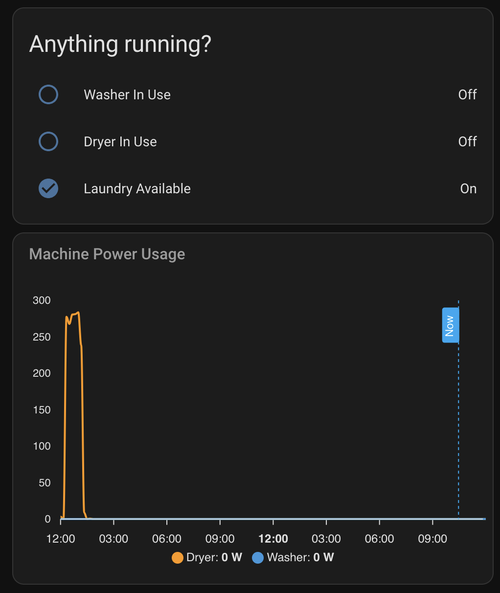

# Home Assistant Laundry Dashboard

## Overview
This setup tracks the usage of laundry machines using [home-assistant.io](https://www.home-assistant.io/) and [SonoffLAN](https://github.com/AlexxIT/SonoffLAN). It was built to save me a trip to the basement when the laundry machines are already occupied.

## Automations
Automations set up sensors and binary states to feed data into the dashboard:
- **Washer In Use:** Tracks when the washer starts running.
- **Dryer In Use:** Tracks when the dryer is active.
- **Laundry Available:** Tracks when both machines are idle.

## Configuration
Sensors monitor power usage and machine activity. Template sensors provide statuses like "Washer In Use" and "Dryer In Use."

## Dashboard
The dashboard uses the [ApexCharts Card](https://github.com/RomRider/apexcharts-card) to show
- **Power Trends:** Washer and dryer power consumption.
- **Current Status:** Machine activity.

"Now" is centered on the graph, showing 24 hours of history on the left and future time on the right.

## Setup
1. Install integrations:
   - [SonoffLAN](https://github.com/AlexxIT/SonoffLAN) and your smart plugs
   - [ApexCharts Card](https://github.com/RomRider/apexcharts-card)
2. Merge `automations.yaml` and `configuration.yaml` into your existing Home Assistant files.
3. Restart Home Assistant.
4. Access the dashboard via the `Laundry` view.

## Editing
Use the [Visual Studio Code Add-on](https://community.home-assistant.io/t/home-assistant-community-add-on-visual-studio-code/107863) for editing.

## Documentation
- [Configuration YAML](https://www.home-assistant.io/docs/configuration/yaml/)
- [Automation YAML](https://www.home-assistant.io/docs/automation/yaml/)
